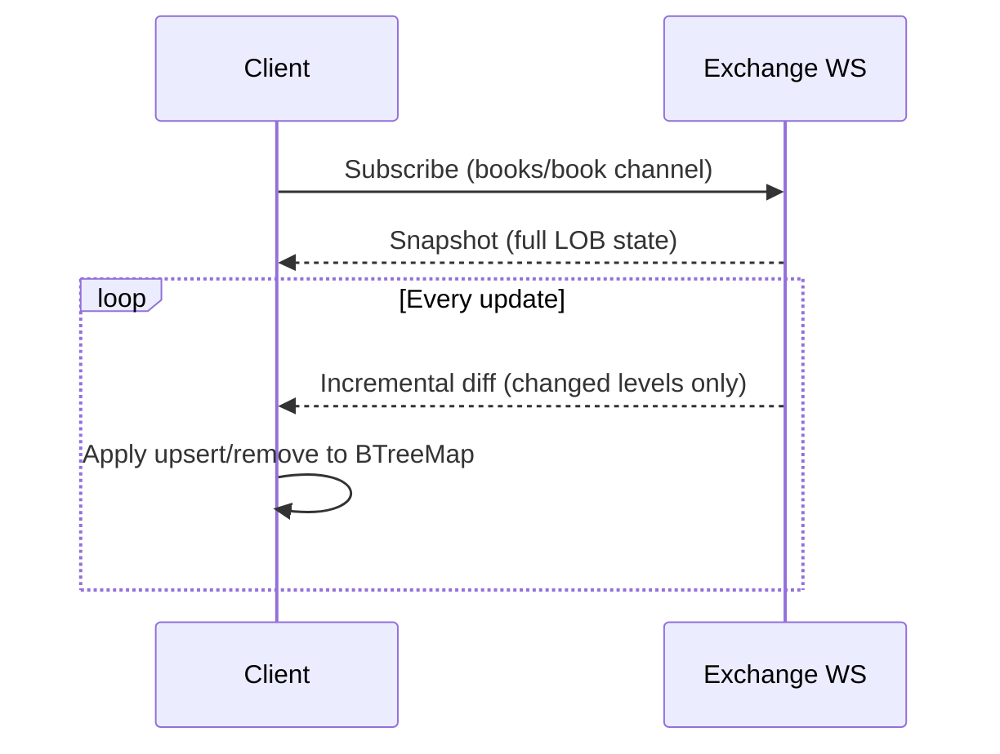
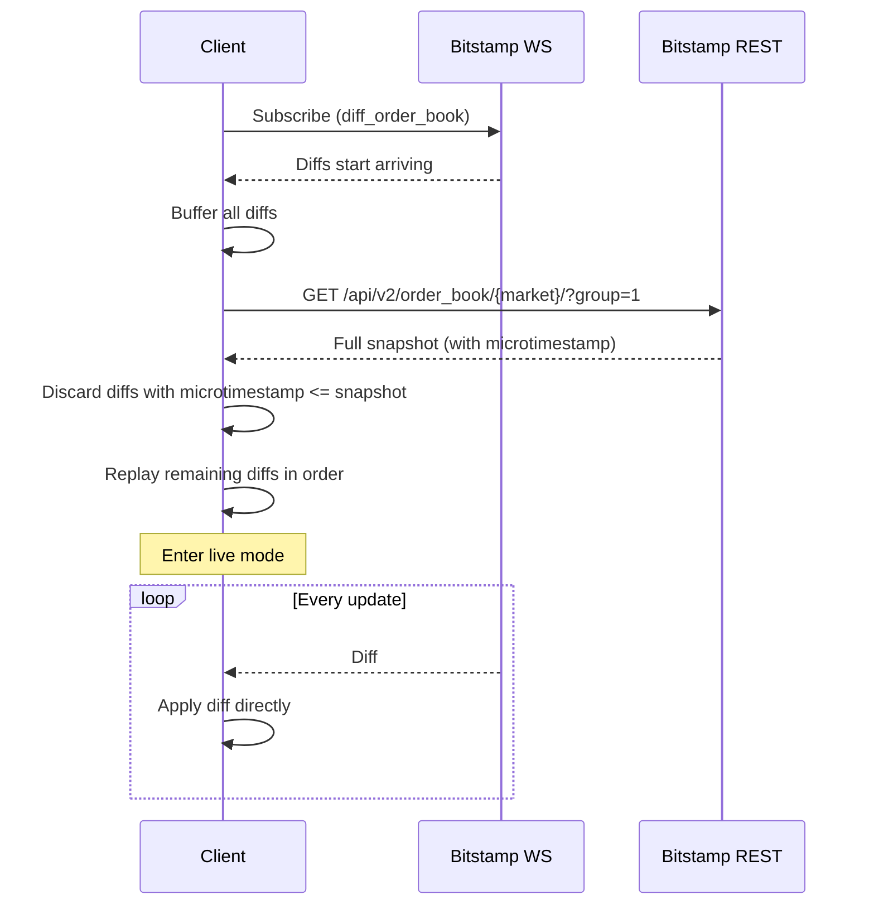

# Exchange Comparison

## Quick Decision Guide

| Need | Recommended Exchange |
|------|---------------------|
| Order-level metadata (count/orders) | **OKX** — only exchange providing this |
| Simplest integration | **OKX** or **Kraken** — no reconciliation needed |
| Full book depth from WS without REST | **OKX** or **Kraken** — native WS snapshots |
| Low latency / microsecond precision | **Bitstamp** — microsecond timestamps |
| Checksum verification | **OKX** or **Kraken** — both provide checksums |
| European endpoint | **OKX** — `--region europe` (default, lower latency via `wseea.okx.com`) |

## LOB & Trade Data Strategies

Each exchange exposes order book and trade data through different WebSocket channels and delivery models. The table below summarizes the key differences.

| Aspect | OKX | Kraken | Bitstamp |
|--------|-----|--------|----------|
| **WS URL (global)** | `wss://ws.okx.com:8443/ws/v5/public` | `wss://ws.kraken.com/v2` | `wss://ws.bitstamp.net` |
| **WS URL (europe)** | `wss://wseea.okx.com:8443/ws/v5/public` | `wss://ws.kraken.com/v2` | `wss://ws.bitstamp.net` |
| **LOB Channel** | `books` | `book` | `diff_order_book_[market]` |
| **Trade Channel** | `trades` | `trade` | `live_trades_[market]` |
| **LOB Delivery** | Snapshot + incremental updates | Snapshot + incremental updates | Diff-only (no WS snapshot) |
| **Reconciliation** | None needed | None needed | REST snapshot + diff buffer replay (ADR-018) |
| **Price Level Format** | String arrays `[px, sz, count, orders]` | Objects `{price, qty}` | String arrays `[px, sz]` |
| **Level Removal** | `size = "0"` | `qty = 0` | `amount = "0"` |
| **Timestamp Precision** | Millisecond epoch | RFC3339 → millisecond | Microsecond epoch |
| **Checksum** | Available (not verified) | Available (not verified) | N/A |
| **Heartbeat** | WS-level Ping/Pong | Explicit `heartbeat` channel | WS-level Ping/Pong |
| **Instrument Format** | `BTC-USDT` (upper, dash) | `XBT/USD` (upper, slash) | `btcusd` (lower, no sep) |
| **REST Snapshot** | Not required | Not required | `GET /api/v2/order_book/[market]/?group=1` |
| **Max Book Depth** | Full (400 levels) | Full | Full (via diff_order_book) |
| **Order Level Detail** | Count + orders per level | Quantity only | Quantity only |

## Delivery Models Explained

### Snapshot + Incremental (OKX, Kraken)

Upon subscribing, the exchange sends a complete snapshot of the order book. Subsequent messages contain only the price levels that changed. The client maintains a `BTreeMap<OrderedFloat<f64>, f64>` mapping price → size, applying upsert/remove per level.

**Pros**: Simple, no external dependencies, state is immediately consistent after snapshot.

**Cons**: Snapshot can be large (up to 400 levels per side), potentially higher latency on reconnect.

### Diff-Only with REST Reconciliation (Bitstamp)

Bitstamp's `diff_order_book` channel sends only incremental changes (no snapshot over WS). The client must:
1. Buffer all incoming diffs upon connect
2. Fetch a full order book snapshot via REST API
3. Discard buffered diffs with `microtimestamp <= snapshot_microtimestamp`
4. Replay remaining diffs in order to catch up to live state
5. Enter live mode — apply subsequent diffs directly

This process runs on every (re)connection to guarantee state consistency.

**Pros**: Full book depth (not limited to top 100 like Bitstamp's `order_book` channel), standard approach used by professional trading firms.

**Cons**: Requires a second connection (REST), more complex reconciliation logic, potential for race conditions if buffered diffs outpace the REST snapshot.

## Pros & Cons by Exchange

### OKX

| Pro | Con |
|-----|-----|
| Mature, well-documented API | Checksum available but adds overhead to verify |
| Standard snapshot+update delivery | Instrument format `-` separator differs from industry norm `/` |
| Order-level detail (count, orders) per price level | 400-level max depth may not suit all strategies |
| Server-side Pong handled transparently | |

Best suited for: Primary execution venue, strategies requiring per-level order metadata, derivatives trading.

### Kraken

| Pro | Con |
|-----|-----|
| Clean object-based JSON (no string arrays to parse) | Uses `XBT` instead of `BTC` (must map instrument names) |
| Explicit heartbeat channel (easy to detect stale connections) | Timestamps in RFC3339 require additional parsing |
| Standard snapshot+update delivery | Smaller liquidity pools on some pairs vs OKX |
| Checksum available for integrity | No per-level count/orders in book data |

Best suited for: Spot trading, pairs with `/` naming convention, strategies needing reliable heartbeat detection.

### Bitstamp

| Pro | Con |
|-----|-----|
| Full book depth via `diff_order_book` | Complex reconciliation required on every connect/reconnect |
| High-precision microsecond timestamps | REST snapshot is an extra HTTP call (latency + failure risk) |
| Wide REST API for fallback data | No checksum verification mechanism |
| Simple `[price, amount]` level format | Instrument format lowercased with no separator (e.g., `btcusd`) |

Best suited for: Strategies requiring full depth, venue arbitrage, pairs with high ticker recognition (BTC/USD, ETH/USD).
