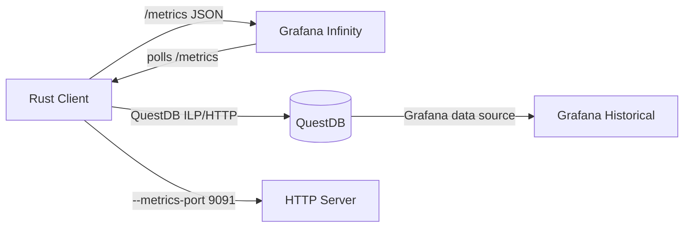

# Grafana LOB Visualization

The Rust client exposes a `/metrics` HTTP endpoint returning a JSON object with real-time LOB data for Grafana visualization. Combined with QuestDB's native Grafana data source, this enables hybrid dashboards with both sub-second updates and historical analysis.

## Architecture



The Infinity datasource (`yesoreyeram-infinity-datasource`) polls the `/metrics` endpoint directly. No Prometheus server is required.

## Metrics Exposed

The `/metrics` endpoint returns a single JSON object at every request:

| Field | Type | Description |
|-------|------|-------------|
| `best_bid` | float | Best bid price |
| `best_ask` | float | Best ask price |
| `last_spread` | float | Spread (ask - bid) |
| `last_update_timestamp` | integer | Last LOB update time (Unix ms) |
| `trades_total` | integer | Total trades received |
| `trades_per_second` | float | Pre-computed trades/second rate |
| `depth` | array | Ordered LOB depth entries — each has `price` (float), `volume` (float), `side` ("bid"/"ask"); sorted ascending by price |

## Dashboard Layout

The included dashboard (`grafana/dashboard.json`) has 6 panels across 3 rows:

1. **Top** (full width): Timeseries bar chart of LOB depth — price on x-axis, cumulative volume on y-axis, bids (green) and asks (red) stacked
2. **Middle** (3 stat blocks): Best Bid, Best Ask, Last Update (ISO datetime)
3. **Bottom** (2 gauges): Spread, Trades Per Second

## Usage

Enable the metrics server by passing `--metrics-port`:

```bash
# Start the client with metrics on port 9091
cargo run -- --metrics-port 9091

# Verify the endpoint
curl http://localhost:9091/metrics
```

For Grafana, add one or both data sources:
- **Infinity** — point to `http://<client-host>:9091/metrics` with parser set to `JSON`; panels reference fields via `root: "$"`
- **QuestDB** — point to your QuestDB HTTP endpoint (e.g. `http://localhost:9000`) for historical queries

See `grafana/README.md` for detailed setup instructions.
